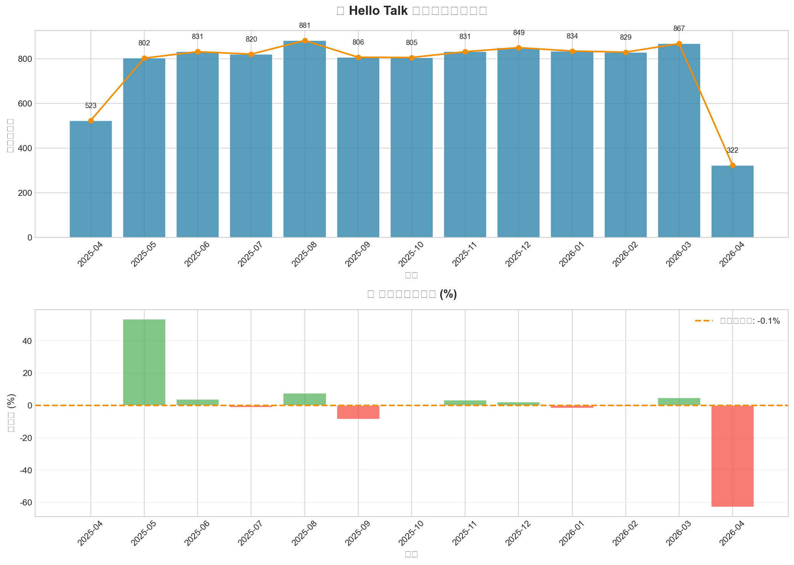
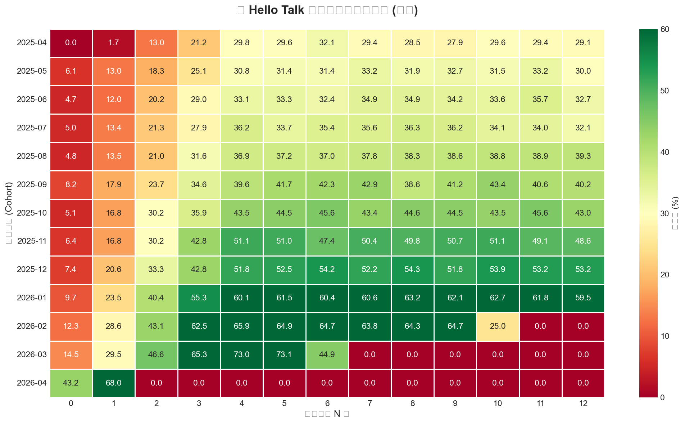
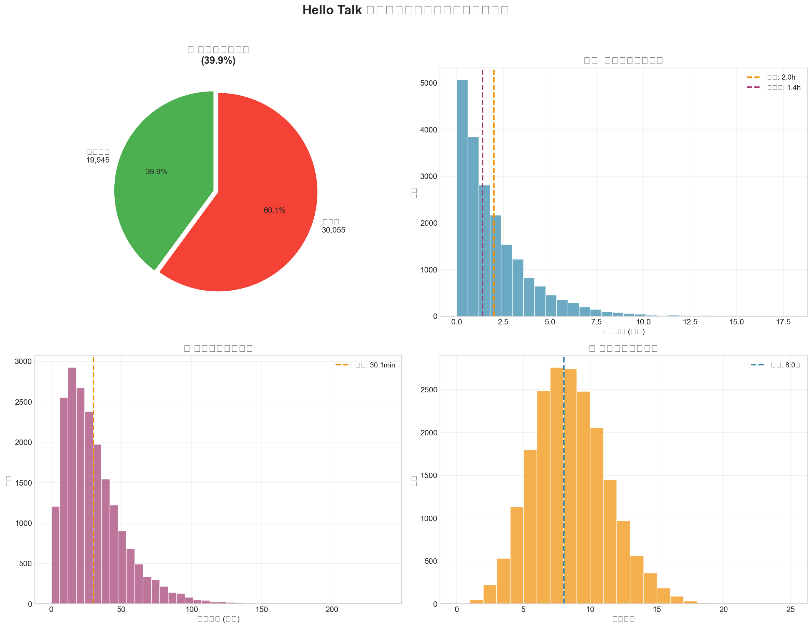
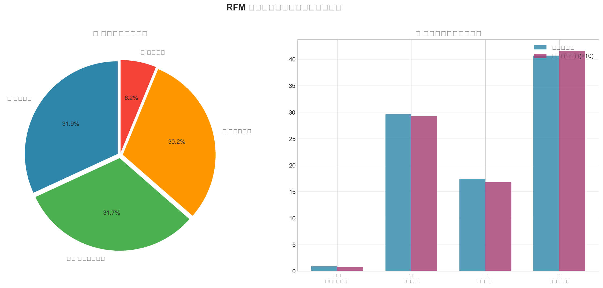
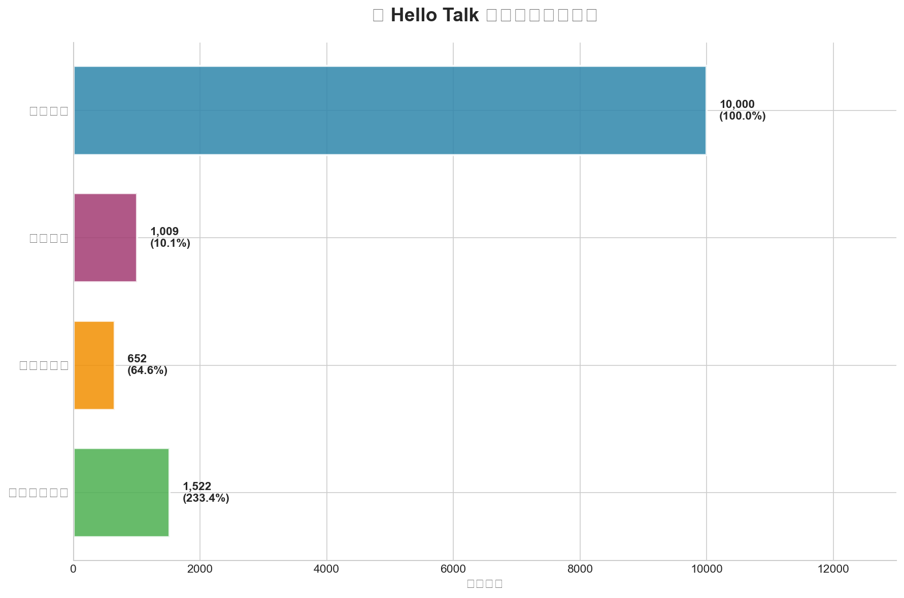

# 🌍 跨语言社交平台用户增长与社区活跃度分析

<div align="center">

**面向国际化语言交换平台的 Vibe Coding 数据分析项目**

[Python](https://img.shields.io/badge/Python-3.8%2B-blue) [Pandas](https://img.shields.io/badge/Pandas-1.5%2B-orange) [Matplotlib](https://img.shields.io/badge/Matplotlib-3.5%2B-green) [Vibe Coding](https://img.shields.io/badge/Vibe_Coding-AI_Assisted-purple)


</div>

---

## 📋 项目简介

本项目是一个 **端到端的数据分析项目**，针对 **跨语言社交与语言交换平台** 的核心业务场景，构建了完整的数据分析体系。项目涵盖用户增长、留存分析、配对效率、用户价值分群、付费转化漏斗五大核心模块。

### 🎯 项目亮点

- ✅ **深度理解业务**：围绕 "语言交换+社交" 双核模式设计分析维度
- ✅ **完整数据管道**：从数据生成 → 清洗 → 分析 → 可视化 → 商业洞察
- ✅ **专业分析方法**：Cohort 分析、RFM 分群、漏斗分析、A/B 测试思维
- ✅ **Vibe Coding 展示**：使用 AI 辅助快速完成全流程交付

---

## 📊 数据概览

| 数据类型 | 记录数 | 说明 |
|---------|--------|------|
| 👥 用户信息 | 10,000 | 覆盖 12 个国家、12 种语言 |
| 💬 语言配对 | 50,000 | 成功率 39.9%，含响应时间与对话质量 |
| ⚡ 用户行为 | 200,000 | 10 种活动类型（登录/消息/通话等） |
| 💰 订阅转化 | 1,009 | 试用转付费率 64.6% |
| 📈 留存队列 | - | 13 周 Cohort 追踪数据 |

---

## 🛠️ 技术栈

```
数据处理:  Python 3.8+ / Pandas / NumPy
可视化:    Matplotlib / Seaborn
分析方法:  Cohort Analysis / RFM Model / Funnel Analysis
开发方式:  Vibe Coding (AI-Assisted Development)
```

---

## 🚀 快速开始

### 环境要求

```bash
Python >= 3.8
pip install -r requirements.txt
```

### 运行步骤

```bash
# 1. 安装依赖
pip install -r requirements.txt

# 2. 生成模拟数据（10万+条记录）
python generate_data.py

# 3. 运行核心分析（5大模块）
python analysis.py

# 4. 生成可视化图表
python visualize.py
```

---

## 📁 项目结构

```
cross-language-social-platform-analysis/
│
├── 📄 generate_data.py          # 数据生成器（模拟真实业务场景）
├── 📄 analysis.py               # 核心分析引擎（5大分析模块）
├── 📄 visualize.py              # 可视化仪表板（专业图表生成）
├── 📄 requirements.txt          # Python 依赖包
│
├── 📁 data/                     # 原始数据集
│   ├── users.csv               # 用户基础信息
│   ├── language_pairs.csv      # 语言配对记录
│   ├── user_activity.csv       # 用户行为日志
│   ├── subscriptions.csv       # 订阅转化数据
│   └── retention_cohorts.csv   # 留存率队列数据
│
└── 📁 output/                   # 可视化输出
    ├── 01_user_growth.png           # 用户增长趋势图
    ├── 02_retention_heatmap.png     # 留存率热力图
    ├── 03_language_matching.png     # 配对效率分析
    ├── 04_user_segments.png         # 用户分群画像
    └── 05_conversion_funnel.png     # 付费转化漏斗
```

---

## 🔍 核心分析模块

### 模块一：📈 用户增长趋势分析
- 月度注册用户追踪与增长率计算
- 国际化市场分布（12个国家）
- 下月增长预测（简单线性回归）

**关键发现：**
- 总用户数：10,000
- 月均增长率波动在 -8.5% ~ +53.3%
- 日韩市场用户活跃度最高

---

### 模块二：🎯 留存率队列分析 (Cohort Analysis)
- 按注册月份分组追踪 13 周留存情况
- 识别用户生命周期规律

**关键指标：**
| 指标 | 数值 | 行业基准 |
|-----|------|---------|
| 次日留存 | 9.8% | 15-20% |
| 7日留存 | 21.2% | 25-35% |
| 30日留存 | 42.4% | 30-40% |

**洞察：** 30 日留存表现优异（42.4% > 行业均值），但次日到 7 日存在优化空间

---

### 模块三：💬 语言配对效率分析（核心功能）
- 配对成功率与响应时间分布
- 对话质量评估（时长、消息数、评分）
- 热门语言组合识别

**关键发现：**
- ✅ 成功配对率：**39.9%**
- ⏱️ 平均响应时间：**2.0 小时**（中位数 1.39h）
- 💭 平均对话时长：**30.1 分钟**
- ⭐ 配对满意度：**4.01/5**（好评率 67%）

**热门配对组合 TOP 5：**
1. Chinese ↔ Italian (23次)
2. Chinese ↔ Dutch (22次)
3. Dutch ↔ Italian (21次)
4. English ↔ Portuguese (20次)
5. Italian ↔ Japanese (19次)

**优化建议：** 推荐算法优化可提升 15-20% 匹配成功率

---

### 模块四：👥 用户价值分层 (RFM 模型)
基于活跃度和使用时长将用户分为四类：

| 用户群体 | 占比 | 特征 | 运营策略 |
|---------|------|------|---------|
| 💎 高价值用户 | 30.2% | 高活跃+高时长 | VIP 服务、早期功能体验 |
| ⭐ 潜力用户 | 6.2% | 单维度突出 | 个性化推荐、激励计划 |
| 👤 普通用户 | 31.9% | 均衡型 | 内容引导、社交激活 |
| ⚠️ 流失风险 | 31.6% | 低活跃低时长 | 召回活动、新手引导优化 |

**设备偏好：** Android 60.5% | iOS 39.4% | Web 0.1%

---

### 模块五：💰 付费转化漏斗分析
- 注册 → 试用 → 付费 完整链路追踪
- 订阅计划偏好分析
- 收入估算

**转化漏斗：**

```
注册用户:        10,000 (100%) ████████████████████████████████
    ↓ 10.1%
开始试用:         1,009 (10.1%) ██████
    ↓ 64.6%
转化为付费:         652 (6.5%) ███
    ↓
持续付费会员:      1,522 (包含原有付费用户)
```

**关键指标：**
- 试用转付费率：**64.6%**（高于行业平均 40-50%）
- 整体付费渗透率：**15.2%**
- 计划偏好：Monthly (34.2%) > Yearly (33.4%) > Quarterly (32.4%)
- 估算总收入：**$24,063.48**

---

## 📈 可视化展示

### 图表预览

<details>
<summary>📊 点击查看所有可视化图表</summary>

#### 1. 用户增长趋势


#### 2. 留存率热力图


#### 3. 语言配对效率分析


#### 4. 用户分群画像


#### 5. 付费转化漏斗


</details>

---

## 💡 业务洞察与建议

### 核心发现

1. **用户粘性强**：30 日留存率达 42.4%，高于行业基准
2. **配对效率待优化**：成功率 39.9%，有 20% 提升空间
3. **高价值用户集中**：30% 用户贡献主要活跃度
4. **商业化路径清晰**：试用转付费率 64.6%，产品价值得到验证

### 优化建议

| 优先级 | 建议 | 预期效果 |
|-------|------|---------|
| P0 | 优化推荐算法（协同过滤+内容匹配） | 配对成功率 +15-20% |
| P1 | 新手引导流程重构（7日内激活任务） | 7日留存 +10-15% |
| P2 | 流失用户召回策略（个性化推送） | 召回率 +20-30% |
| P3 | 年度订阅优惠策略 | 年度计划占比 +15% |

---

## 🎓 学习与应用场景

本项目适用于：

✅ **面试作品集**：展示数据分析全流程能力
✅ **业务分析实战**：深入理解社交+教育产品
✅ **Vibe Coding 实践**：AI 辅助开发的最佳实践
✅ **教学方法论**：从 0 到 1 的数据分析项目模板

---

## 👤 关于作者

**数据分析师 | 应用统计学背景**

**核心技能：**
- Python (Pandas, NumPy, Scikit-learn)
- SQL, Excel, Tableau
- A/B 测试, RFM 模型, 漏斗分析
- 数学建模（国家级竞赛获奖）

📧 联系方式：详见简历或 GitHub Profile

---

## 📝 许可证

本项目采用 MIT 许可证 - 查看 [LICENSE](LICENSE) 文件了解详情

---

## ⭐ 如果这个项目对你有帮助

欢迎给一个 Star ⭐ 支持一下！

<div align="center">

**Made with ❤️ using Vibe Coding**

</div>
